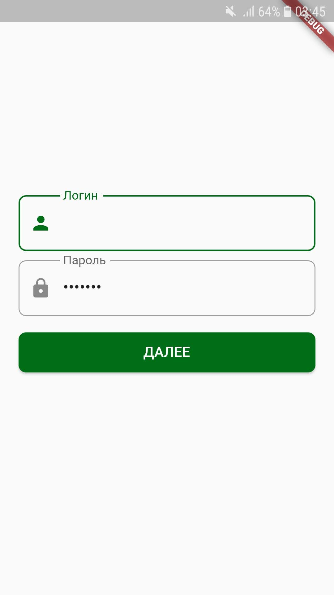
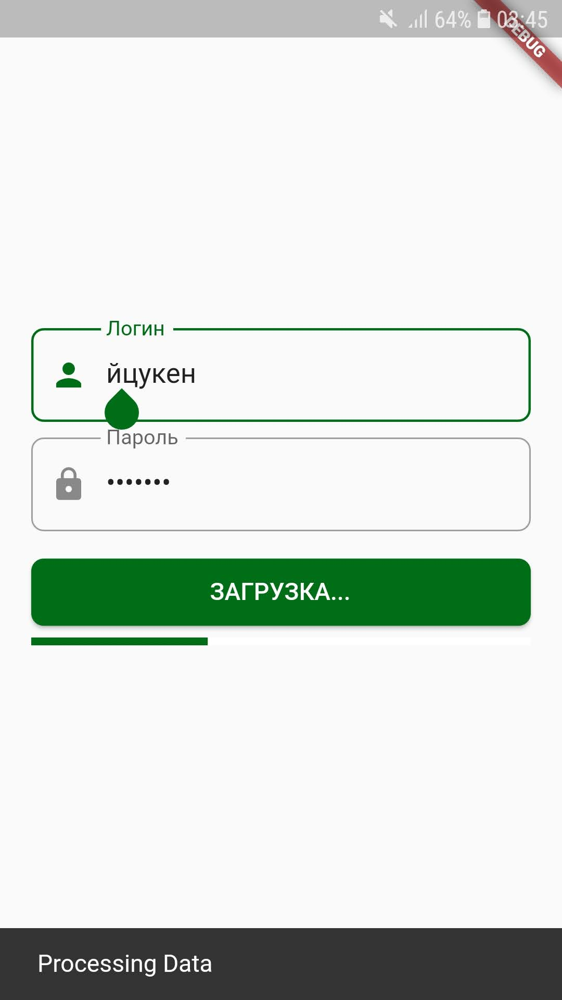

# Целевая платформа

Проверял на Android 11. iOS не пробовал. Другие платформы не подключал.

# Результаты

[здесь можете похвастаться, что успели реализовать, или сделали что-то сверх задания, или добавили свой Payload]

Успел сделать только задание 1 и начал немного задание 3. Не хватило знаний, чтобы быстро разобраться в других заданиях. Прохожу курс Flutter by Surf. Пока занимаемся только версткой.

# Ссылки на демонстрацию работы/скриншоты

Пару скриншотов экрана авторизации:

